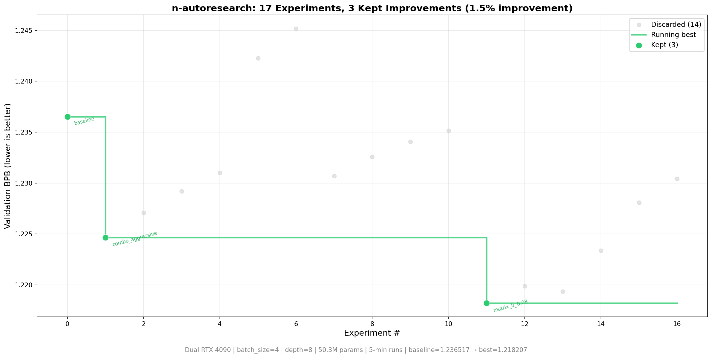

# n-autoresearch



`n-autoresearch` is Athena: a Kubernetes-native autonomous ML/RL research platform. The product API is Kubernetes. Research intent, execution policy, benchmark definitions, observed status, artifacts, metrics, dashboards, and console views are modeled through CRDs, controller reconciliation, Kubernetes Jobs, Prometheus, Grafana, and GitOps-rendered manifests.

This repository is moving away from local loops, bespoke workers, ad-hoc REST state, and log scraping. Workload code may still be Python, but durable product state belongs in Kubernetes objects and controller-owned status.

## How Athena Works

Athena separates desired state, observed state, execution, metrics, and reporting into Kubernetes-native components:

- **`Experiment`** — one concrete trial with hypothesis, provenance, budget, objective, artifact refs, and controller-owned observed status.
- **`BenchmarkSuite`** — benchmark definition with tasks, datasets, evaluators, metric requirements, gates, holdout policy, and integrity requirements.
- **`BenchmarkRun`** — one execution of a suite/subset against a target experiment, campaign, model, image, git ref, or runtime profile.
- **`MetricSource`** — reusable contract for parsing and normalizing declared metric artifacts.
- **`ResearchCampaign`** — autonomous research loop policy, novelty constraints, promotion criteria, duplicate detection, and aggregate outcomes.
- **`RuntimeProfile`** — execution policy for runner images, scheduling, GPUs, workspace mounts, resources, sandboxing, and observability.

Controllers reconcile these resources into Kubernetes Jobs/Pods/PVCs/Events and publish bounded summaries through status fields and Prometheus metrics. Runner Jobs are stateless: they write declared artifacts and exit; controllers parse artifacts and own authoritative status.

## Source Of Truth

- Desired state lives in CR specs under `research.nixlab.io/v1alpha1`.
- Observed state lives in controller-owned CR status, Kubernetes Events, and Prometheus metrics.
- Large raw outputs live in workspace artifacts referenced from status.
- Deployable resources flow through Nix/Helm-generated manifests and GitOps.
- Console views read Kubernetes resources through the Go BFF and must display redacted DTOs/status, not recomputed authority.

## Project Structure

```text
AGENTS.md                         repository rules for Athena/Kubernetes-native work
docs/openspec.md                  build spec for CRDs, controllers, benchmarks, observability, console
operator/                         Rust kube-rs operator and CRD API crates
athena-console/                   Go BFF + Vue console
nix/athena/                       Nix-rendered Helm/Kubernetes deployment definitions
modules/k8s/manifests.yaml        generated GitOps manifests from .#k8s-manifests
examples/                         example Athena CRs and canaries
experiments/                      stateless train/eval workload code for Kubernetes Jobs
workers/                          legacy paths; do not extend for Athena behavior
config/                           legacy/local config; not Athena product state
```

## Build And Validation

```bash
# Build generated Kubernetes manifests
nix build .#k8s-manifests

# Build Helm chart
nix build .#helm-chart

# Format Nix files
nix fmt
```

Workload-only local checks are useful when editing `experiments/`, but they are not Athena orchestration:

```bash
uv sync
uv run experiments/train.py
```

Local runs must not create or infer authoritative `Experiment`, `BenchmarkRun`, `ResearchCampaign`, or metric status. Controllers own that.

## Design Rules

- New product behavior starts with the Kubernetes object that owns desired state and observed state.
- Benchmark execution belongs in `BenchmarkRun` reconciliation, not client-side scripts or local daemons.
- Metrics must be stable, normalized, low-cardinality, and surfaced through CR status and Prometheus.
- Dashboards, ServiceMonitors, alerts, Loki/log links, and console visibility are part of the product surface.
- Legacy iii workers, local REST loops, SQLite/KV state, and log scraping are not the path forward.

## License

Apache-2.0
